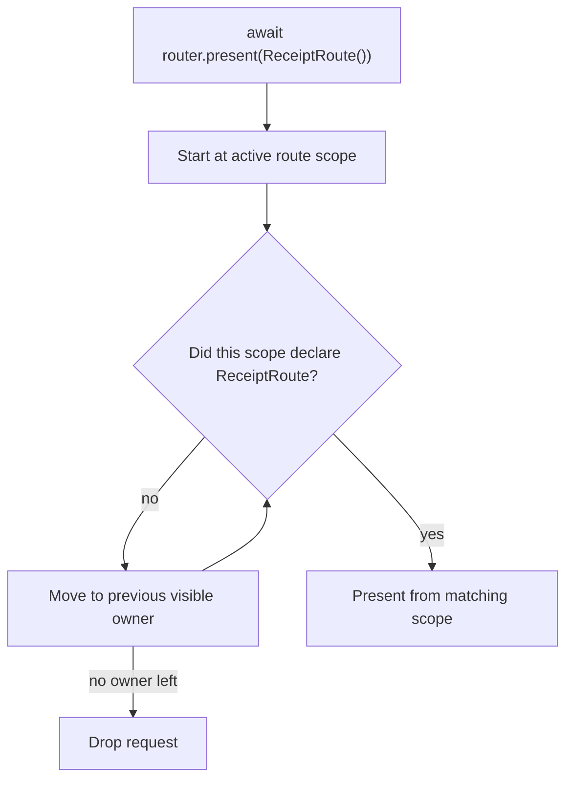
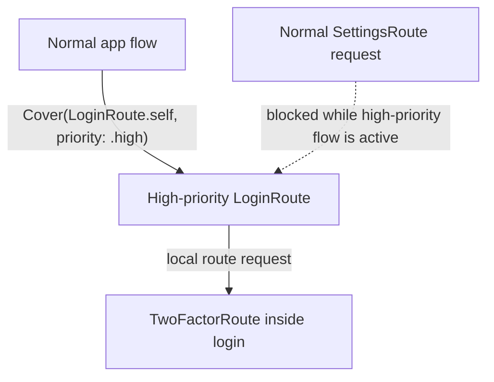

# 🛫 Departure

Departure is a lightweight, expressive routing framework for SwiftUI.

It lets visible views declare the routes they own, then lets any active route ask Departure to present a route by type. Departure finds the closest visible owner and uses SwiftUI presentation APIs such as pushes, sheets, and full-screen covers.

```swift
await router.present(SettingsRoute())
```

The point is to keep navigation local without forcing every feature to receive a pile of callbacks.

## Install

Departure is available via Swift Package Manager.

```swift
dependencies: [
  .package(url: "https://github.com/mtzaquia/departure.git", from: "1.0.0"),
],
```

## Quick Start

### 1. Wrap Your App

Use `WithRouter` near the root of your SwiftUI tree:

```swift
@main
struct ExampleApp: App {
  var body: some Scene {
    WindowGroup {
      WithRouter {
        NavigationStack {
          HomeView()
        }
      }
    }
  }
}
```

> [!NOTE]
> Departure installs presentation handlers from `.routes { ... }`, but push presentation still needs a `NavigationStack` somewhere above the declaring view.

### 2. Define a Route

A route is a value that builds its destination.

```swift
struct SettingsRoute: Route {
  func destination() -> some View {
    SettingsView()
  }
}
```

Routes are matched by type. Two `SettingsRoute()` values target the same declaration.

### 3. Declare Where It Belongs

Attach routes to the view scope that owns them:

```swift
struct HomeView: View {
  @Environment(Router.self) private var router

  var body: some View {
    Button("Settings") {
      Task {
        await router.present(SettingsRoute())
      }
    }
    .routes {
      Sheet(SettingsRoute.self)
    }
  }
}
```

When `SettingsRoute()` is requested, Departure starts from the active route and looks backward through visible route scopes until it finds the nearest scope that declared `SettingsRoute.self`.

## Presentation Styles

Use `Push`, `Sheet`, or `Cover` inside `.routes { ... }`.

```swift
.routes {
  Push(ProfileRoute.self)
  Sheet(SettingsRoute.self)
  Cover(OnboardingRoute.self)
}
```

| Declaration | SwiftUI behavior | Notes |
| --- | --- | --- |
| `Push(Route.self)` | `navigationDestination(item:)` | Requires a `NavigationStack` above the scope. |
| `Sheet(Route.self)` | `sheet(item:)` | Wraps the destination in a `NavigationStack` by default. |
| `Cover(Route.self)` | `fullScreenCover(item:)` on UIKit, `sheet(item:)` fallback elsewhere | Wraps the destination in a `NavigationStack` by default. |

Disable the automatic navigation wrapper for sheets and covers when the destination provides its own container:

```swift
.routes {
  Sheet(EditorRoute.self, providesNavigation: false)
  Cover(PlayerRoute.self, providesNavigation: false)
}
```

## Route Ownership

Route requests are resolved by visible ownership.



That gives feature views a simple rule:

> Declare the routes your feature can present. If a child asks for one of those routes, the request comes back to you.

If no visible scope declared the route type, the request is ignored.

## Branches

Use branches for selection-based containers such as tabs.

```swift
enum AppTab: Hashable, Sendable {
  case home
  case wallet
}

struct RootView: View {
  @State private var tab: AppTab = .home

  var body: some View {
    TabView(selection: $tab) {
      NavigationStack {
        HomeView()
          .routeBranch(AppTab.home)
      }
      .tag(AppTab.home)

      NavigationStack {
        WalletView()
          .routeBranch(AppTab.wallet)
      }
      .tag(AppTab.wallet)
    }
    .routes(branch: $tab) {
      Cover(LoginRoute.self, priority: .high)

      Branch(.home) {
        Push(HomeDetailRoute.self)
      }

      Branch(.wallet) {
        Sheet(TransactionRoute.self)
      }
    }
  }
}
```

`.routes(branch:)` declares the full route map for a selection container. This lets Departure find routes in lazy branches that have not been built yet. Declarations inside `Branch(...)` are used for crawling and branch selection at the container, then adopted by the matching `.routeBranch(...)` view as local presentation declarations.

Top-level declarations in the same `.routes(branch:)` builder, such as `Cover(LoginRoute.self, priority: .high)`, belong to the container itself.

If a request matches a route declared in an inactive branch, Departure selects that branch before presenting the route from the mounted `.routeBranch(...)` host.

When a branch is not lazy, declaring the same route locally is equivalent:

```swift
HomeView()
  .routeBranch(AppTab.home)
  .routes {
    Push(HomeDetailRoute.self)
  }
```

## Priority

Sheets and covers can be normal or high priority.

```swift
.routes {
  Sheet(ProfileRoute.self)
  Cover(LoginRoute.self, priority: .high)
}
```

| Priority | Behavior |
| --- | --- |
| `.normal` | Presents from the nearest visible owner, unless a high-priority presentation is already covering the normal flow. |
| `.high` | Presents above the normal flow in a separate high-priority window on UIKit. A new high-priority request from the normal flow replaces the active high-priority presentation. |

Inside a high-priority route, normal and high-priority declarations behave like local navigation for that high-priority flow.

> [!IMPORTANT]
> High priority changes presentation context, not route lookup. Branch routes are still resolved with the same crawling rules; when a high-priority branch route is selected, the high-priority window uses the active branch presentation scope.

### High-Priority Window Environment

`windowDestination` customizes destinations presented through Departure's separate high-priority window. Use it to explicitly forward environment values that should cross the `UIWindow` boundary.

```swift
WithRouter {
  AppRoot()
} windowDestination: { destination, environment in
  destination
    .environment(\.locale, environment.locale)
    .environment(\.dynamicTypeSize, environment.dynamicTypeSize)
    .environment(\.colorScheme, environment.colorScheme)
}
```

Without `windowDestination`, high-priority destinations are presented unchanged. Normal in-tree presentations do not use this hook.



## Route Resolution

Routes can allow, redirect, or drop themselves before ownership is resolved.

```swift
struct ProtectedSettingsRoute: Route {
  let isLoggedIn: Bool

  func resolveRoute() async -> RouteResolution {
    isLoggedIn ? .allow : .reroute(LoginRoute())
  }

  func destination() -> some View {
    SettingsView()
  }
}
```

> [!IMPORTANT]
> On `.reroute(route)`, Departure evaluates the new route before matching it to an owner. Keep resolution quick and avoid recursive reroutes.

## Actions

Actions are work values that run against the active route context.

```swift
struct SaveDraftAction: Action {
  func attemptAction(in context: ActionContext) async throws(ActionInvocationError) {
    guard context.isRunning(in: EditorRoute.self) else {
      throw .reroute(EditorRoute())
    }

    // Save the draft.
  }
}
```

Run an action from SwiftUI through the router:

```swift
struct ToolbarView: View {
  @Environment(Router.self) private var router

  var body: some View {
    Button("Save") {
      Task {
        await router.perform(SaveDraftAction())
      }
    }
  }
}
```

If an action throws `.reroute(route)`, Departure requests that route using the same ownership rules, then retries the action once.

> [!NOTE]
> Route requests crawl backward to find an owner. Actions do not crawl for work execution; they run in the active route context.

## Hooks

Hooks are route-scoped behavior declarations. Attach them with `.hooks { ... }` on the view that owns the behavior.

```swift
struct EditorView: View {
  var body: some View {
    EditorContent()
        .hooks {
          ActionInterceptor(SaveDraftAction.self) { invocation in
            do {
              try await invocation()
            } catch {
              // React to the failed save attempt.
            }
          }
        }
  }
}
```

Hooks attach to the current route scope and disappear when that scope is dismissed. Inside a selected `.routeBranch(...)`, hooks attach to that branch-local scope, so selected tab content can intercept actions without changing route ownership. For actions, Departure checks only the active scope for a matching `ActionInterceptor`. If no interceptor matches, the action runs normally. If an interceptor matches, that interceptor owns the action flow and must call `invocation()` when the original action should run.

### Action Interceptors

`ActionInterceptor` lets a scope wrap or replace execution for a matching action type.

```swift
.hooks {
  ActionInterceptor(SaveDraftAction.self) { invocation in
    try? await invocation()
  }
}
```

The interceptor receives an `invocation` closure for the original action. Call it to continue action execution, or do not call it to consume the action.

```swift
.hooks {
  ActionInterceptor(DeleteDraftAction.self) { _ in
    // Consume the action without running DeleteDraftAction.attemptAction(in:).
  }
}
```

If an intercepted action throws `.reroute(route)` from its original implementation, calling `invocation()` preserves the normal reroute behavior: Departure presents the route, then retries the action once from the new active scope.

## Unwind

Unwind is the counterpart to presentation: instead of asking for a new route, a view asks Departure to dismiss the current route or dismiss back to a known route scope.

```swift
await router.unwind()
```

`await router.unwind()` dismisses the current route. If the current route is the only route in the path, it unwinds to the root scope.

Use an explicit target when you want to dismiss more than one route:

```swift
await router.unwind(to: .root)
await router.unwind(to: .id("settings-flow"))
```

| API | Behavior |
| --- | --- |
| `await router.unwind()` | Dismisses the current route. |
| `await router.unwind(to: .root)` | Clears all presented routes and returns to the root scope. |
| `await router.unwind(to: .id(id))` | Keeps the matching route scope and dismisses everything after it. |

Scope IDs are useful when a view owns a named flow:

```swift
SettingsFlowView()
  .routes(id: "settings-flow") {
    Push(AdvancedSettingsRoute.self)
    Sheet(AccountRoute.self)
  }
```

You can also ask Departure to present another route after the unwind completes:

```swift
await router.unwind()
await router.present(ProfileRoute())

if await router.unwind(to: .id("settings-flow")) {
  await router.present(LoginRoute(nextRoute: ProfileRoute()))
}
```

For example, a completion screen can dismiss itself and continue with a route owned by an earlier visible scope:

```swift
struct CompletionView: View {
  @Environment(Router.self) private var router

  var body: some View {
    Button("Done") {
      Task {
        await router.unwind()
        await router.present(SummaryRoute())
      }
    }
  }
}
```

Departure removes the route scopes from its path first, then waits for any mounted dismissed route views to leave SwiftUI before requesting the continuation route. The continuation is a normal route request: it resolves, crawls visible scopes, selects branches, observes priority, and may still be dropped if no eligible declaration exists.

> [!NOTE]
> `unwind(to:)` returns `false` when an explicit target is not found. Check the return value before presenting a continuation route when you need the same behavior as the deprecated `thenPresent` request.

## Compatibility

`RoutingAction` and `EnvironmentValues.routing` remain available for existing apps, but they are deprecated. Prefer reading `Router` directly from the environment:

```swift
@Environment(Router.self) private var router

await router.present(SettingsRoute())
await router.perform(SaveDraftAction())
await router.unwind(to: .root)
```

## License

Copyright (c) 2026 @mtzaquia

Permission is hereby granted, free of charge, to any person obtaining a copy
of this software and associated documentation files (the "Software"), to deal
in the Software without restriction, including without limitation the rights
to use, copy, modify, merge, publish, distribute, sublicense, and/or sell
copies of the Software, and to permit persons to whom the Software is
furnished to do so, subject to the following conditions:

The above copyright notice and this permission notice shall be included in all
copies or substantial portions of the Software.

THE SOFTWARE IS PROVIDED "AS IS", WITHOUT WARRANTY OF ANY KIND, EXPRESS OR
IMPLIED, INCLUDING BUT NOT LIMITED TO THE WARRANTIES OF MERCHANTABILITY,
FITNESS FOR A PARTICULAR PURPOSE AND NONINFRINGEMENT. IN NO EVENT SHALL THE
AUTHORS OR COPYRIGHT HOLDERS BE LIABLE FOR ANY CLAIM, DAMAGES OR OTHER
LIABILITY, WHETHER IN AN ACTION OF CONTRACT, TORT OR OTHERWISE, ARISING FROM,
OUT OF OR IN CONNECTION WITH THE SOFTWARE OR THE USE OR OTHER DEALINGS IN THE
SOFTWARE.
