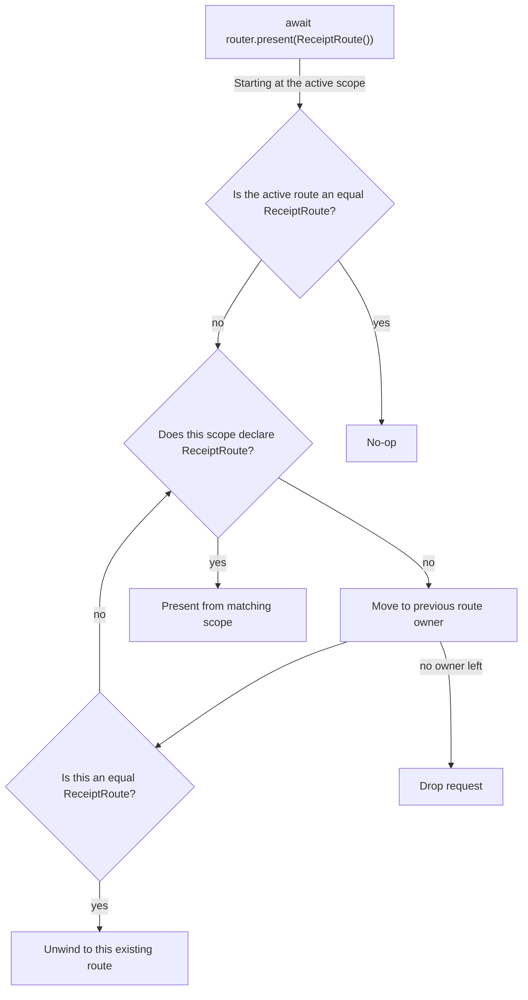
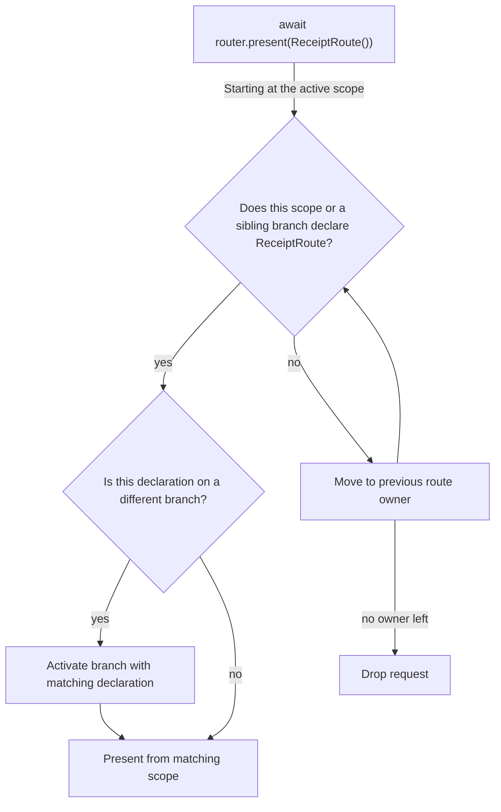
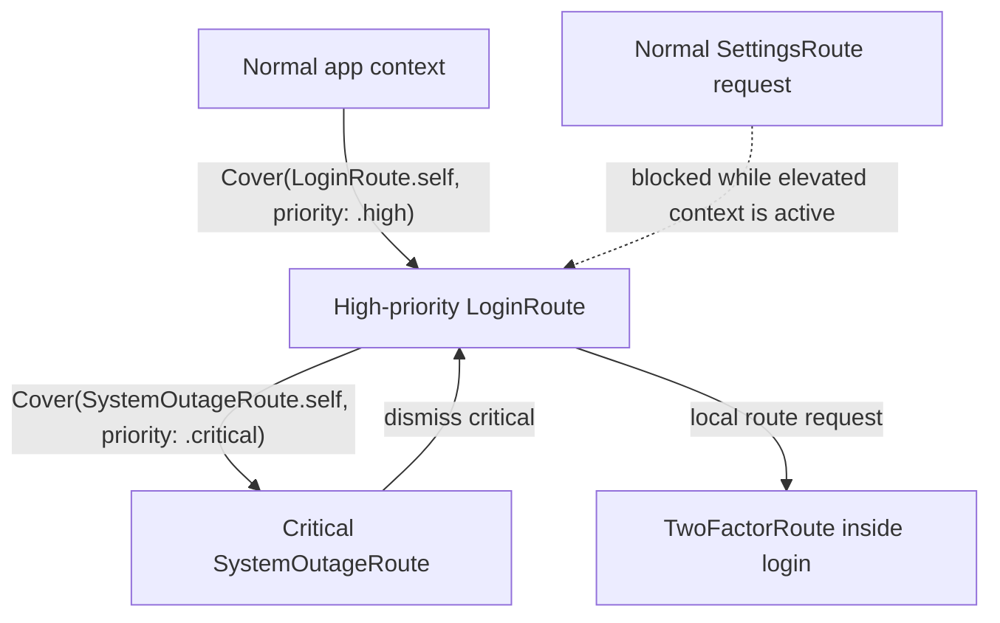

# 🛫 Departure

`Departure` is a robust, expressive routing framework for SwiftUI.

It lets views declare the routes they can handle and the presentation style for each route. The router then presents the closest matching route. Triggered actions run against the active route scope, can be intercepted by route-scoped hooks, and can request a reroute before execution is retried.

## Mental model

A route tree can be understood as a three-dimensional navigation model:

- **X is routing depth.** A push, modal, or branch root advances the active navigation by one level.
- **Y is modal depth.** Presenting a modal advances both X and Y. A route inside that modal may present another modal at the next Y level.
- **Z is branching.** Branches preserve independent push paths, but share the tree's modal layers. Only one modal can occupy a given Y level across all branches.
- **Priority creates another tree.** Normal, high, and critical contexts have separate route trees. High and critical trees render from router-level windows and retain the scope where they originated so lower-priority requests can be admitted, blocked, or replaced correctly.

`router.present(...)` always begins lookup from the top-most active scope. The elevated origin is the presentation scope selected by route lookup; it is not the view that happened to call `present`.

Navigation mutations are serialized. If several presentation requests arrive while an unwind or replacement is waiting for SwiftUI to remove old scopes, the latest pending request wins.
A pending presentation is discarded if its calling task is cancelled before the active navigation mutation finishes.

### Engine rules

- Route lookup starts at the top-most active scope and crawls toward the root. A matching declaration deeper in that crawl wins over a shallower one.
- A declaration in an inactive branch activates that branch before presentation. The request waits when necessary for the selected branch scope to enter the view hierarchy.
- Encountering an equivalent route on the target path stops presentation. If the equivalent route is an ancestor, the path unwinds to it instead of creating another instance.
- Pushes, sheets, covers, and branch roots each add one X level. Sheets and covers also add one Y level.
- A tree has one modal lane per Y depth, shared by all of its branches. Presenting a sheet or cover replaces any existing modal at that depth; a modal may present another modal at the next depth.
- Branches keep independent push paths on Z. Switching branches preserves inactive push state, but never preserves a modal that was replaced in the shared Y lane.
- The router always has a normal tree. A request above the active priority starts or replaces a separate high or critical tree whose root renders in a router-level window. A declaration matched inside an active tree whose priority is equal or higher appends locally to that tree.
- An elevated request records the presentation scope selected before its tree starts; it is not the view that called `present`. While that request waits for its scope to mount, it reserves its priority: lower-priority requests are dropped, while equal or higher priorities may replace it.
- Rerouted values are resolved repeatedly until a route returns `.allow` or `.drop`, then declaration lookup begins for that final route.
- While an unwind or modal replacement is waiting for removed views to leave, presentation requests are serialized and only the latest pending request is retained.
- Only the top-most current route scope reads `routePhase == .active`. Its branch root, container, and other ancestors remain installed but read `.inactive` while a descendant push or modal is current.

```swift
await router.present(SettingsRoute())
```

## Install

`Departure` is available via Swift Package Manager, and supports iOS 17 or later and macOS 14 or later.

```swift
dependencies: [
  .package(url: "https://github.com/mtzaquia/departure.git", from: "2.0.0"),
],
```

## Quick start

This is the smallest end-to-end shape: install a router, define a route, declare where that route can be presented, then ask the router to present it.

```swift
@main
struct ExampleApp: App {
  var body: some Scene {
    WindowGroup {
      WithRouter {
        NavigationStack {
          HomeView()
        }
      }
    }
  }
}

struct SettingsRoute: Route {
  func destination() -> some View {
    SettingsView()
  }
}

struct SettingsView: View {
  var body: some View {
    Text("Settings")
  }
}

struct HomeView: View {
  @Environment(Router.self) private var router

  var body: some View {
    Button("Settings") {
      Task {
        await router.present(SettingsRoute())
      }
    }
    .routes {
      Sheet(SettingsRoute.self)
    }
  }
}
```

> [!NOTE]
> When using `Push(...)` inside `.routes { ... }`, ensure the route is declared within a `NavigationStack`.

## Routes and Actions

### Routes

A route is a value that builds its destination.

```swift
struct SettingsRoute: Route {
  func destination() -> some View {
    SettingsView()
  }
}
```

Routes can also allow, redirect, or drop themselves before ownership is resolved.

```swift
struct ProtectedSettingsRoute: Route {
  let isLoggedIn: Bool

  func resolveRoute() async -> RouteResolution {
    isLoggedIn ? .allow : .reroute(LoginRoute())
  }

  func destination() -> some View {
    SettingsView()
  }
}
```

> [!IMPORTANT]
> On `.reroute(route)`, `Departure` continues evaluating rerouted values until one returns `.allow` or `.drop`. Keep resolution quick and avoid recursive reroutes; cycle prevention is the route's responsibility.

### Actions

Actions are work values that run against the active route scope.

```swift
struct SaveDraftAction: Action {
  func attemptAction(in context: ActionContext) async throws(ActionInvocationError) {
    guard context.isRunning(in: EditorRoute.self) else {
      throw .reroute(EditorRoute())
    }

    // Save the draft.
  }
}
```

If an action throws `.reroute(route)`, `Departure` requests that route, then retries the action **once**.

## Declarations

### `.routes(...)`

Declare routes in the scope that can present them.

```swift
.routes {
  Push(ProfileRoute.self)
  Sheet(SettingsRoute.self)
  Cover(OnboardingRoute.self)
}
```

The nearest matching scope, including the current scope, presents the route with the declared style. You can declare the same route type in multiple places; the nearest matching owner wins.

| Style | Behavior |
| --- | --- |
| `Push` | Pushes onto the nearest `NavigationStack`. |
| `Sheet` | Presents a sheet. |
| `Cover` | Presents a full-screen cover. |

> [!NOTE]
> `Sheet` and `Cover` wrap their destinations in a `NavigationStack` by default. Opt out using
> `providesNavigation: false`.

### `.hooks(...)`

Hooks are route-scoped behavior declarations. Attach them with `.hooks { ... }` on the view that owns the behavior.

```swift
struct EditorView: View {
  var body: some View {
    EditorContent()
      .hooks {
        ActionInterceptor(SaveDraftAction.self) { invocation in
          do {
            try await invocation()
          } catch {
            // React to the failed save attempt.
          }
        }
      }
  }
}
```

Hooks attach to the current route scope and share its lifecycle.

| Hook | Behavior |
| --- | --- |
| `ActionInterceptor` | Wraps or replaces execution for a matching action type. |
| `UnwindHandler` | Reacts when a matching route unwinds into that scope's subtree. |

For actions, `Departure` checks only the active scope for a matching `ActionInterceptor`. If no interceptor matches, the action is attempted directly. If an interceptor matches, **that interceptor owns the action flow** and must call `invocation()` when the original action should run.

```swift
.hooks {
  ActionInterceptor(DeleteDraftAction.self) { _ in
    // Consume the action without running DeleteDraftAction.attemptAction(in:).
  }
}
```

If an intercepted action throws `.reroute(route)` from its original implementation, `invocation()` will perform the reroute, retry the action in the new scope, and throw a `CancellationError` in the current interceptor.

`UnwindHandler` can also expect a typed payload. **The handler only runs when the unwind payload matches the declared payload type.** A warning is emitted if the expected payload type doesn't match the one provided.

```swift
.hooks {
  UnwindHandler(EditorRoute.self, expecting: SaveResult.self) { result in
    showToast(for: result)
  }
}
```

An `UnwindHandler` runs when the unwind request is accepted. The router does not wait for the
handler body to finish before continuing the unwind. If the handler presents another route, that
request is deferred until the active navigation has finished.

```swift
.hooks {
  UnwindHandler(EditorRoute.self) {
    await router.present(ConfirmationRoute())
  }
}
```

When a route unwinds, `Departure` first determines the scope where the unwind lands. It then checks
that scope for a matching `UnwindHandler` and crawls backward through its owning scopes until it
finds one. The nearest matching handler wins, and only one handler runs for each unwind. The unwind
target controls where the router lands; handler lookup always follows the same crawl-back rule from
that landing scope.

> [!NOTE]
> SwiftUI's `dismiss()` also triggers unwind handlers with no payload if the types match.

### Duplicate declarations

If a scope declares multiple handlers for the same route, multiple action interceptors for the same action, or multiple unwind handlers for the same route, only the first declaration is used; all subsequent declarations are ignored. In these cases, `Departure` emits a runtime warning.

```swift
.routes {
  Sheet(MessageRoute.self) // Used for MessageRoute.
  Cover(MessageRoute.self) // Ignored; the first declaration wins.
}

.hooks {
  ActionInterceptor(SaveDraftAction.self) { invocation in
    try? await invocation()
  }

  ActionInterceptor(SaveDraftAction.self) { _ in
    // Ignored; the first interceptor wins.
  }
}
```

## Router calls

### `.present(...)`

Use `present` to request a route.

```swift
struct ToolbarView: View {
  @Environment(Router.self) private var router

  var body: some View {
    Button("Settings") {
      Task {
        await router.present(SettingsRoute())
      }
    }
  }
}
```

Route requests crawl backward to find an owner. If an existing route compares equal through `Equatable`, the router unwinds back to it rather than attempting to re-present it.



> [!NOTE]
> If no active scope can resolve the route type, the request is ignored.

### `.perform(...)`

Use `perform` to run an action from SwiftUI through the router.

```swift
struct ToolbarView: View {
  @Environment(Router.self) private var router

  var body: some View {
    Button("Save") {
      Task {
        await router.perform(SaveDraftAction())
      }
    }
  }
}
```

Actions do not crawl for work execution; they run in the active route scope, or unconditionally when there are no interceptors.

### Route phase

Read `routePhase` from the environment when a view needs to know whether its route scope is active.

```swift
struct EditorToolbar: View {
  @Environment(\.routePhase) private var routePhase

  var body: some View {
    SaveButton()
      .disabled(routePhase != .active)
  }
}
```

The value is local to the current route scope. It updates for root content, route destinations, and
branch roots, including destinations presented in elevated-priority windows.

### `.unwind(...)`

Use router unwind calls when you want to return to a known route scope or coordinate broader routing
state. Prefer `@Environment(\.unwindRoute)` for local dismiss buttons and callbacks.

```swift
await router.unwind(to: .root)
await router.unwind(to: .previous)
await router.unwind(to: .nearestBranch)
await router.unwind(to: .id("settings-flow"))
```

| API | Behavior |
| --- | --- |
| `await router.unwind(to: .root)` | Returns to the app root, clearing presented routes and any branch containers owned by those routes. |
| `await router.unwind(to: .previous)` | Dismisses the current top-most route scope. |
| `await router.unwind(to: .nearestBranch)` | Clears the nearest enclosing branch path back to that branch's root without unwinding to the app root. |
| `await router.unwind(to: .id(id))` | Keeps the matching route scope and dismisses everything after it. |

> [!NOTE]
> Branch paths live under the scope that declares their `.routes(branch:)` container. If an unwind goes past that container scope, all of its branches are destroyed. If the container scope remains installed after an unwind, inactive branch push stacks aren't impacted.

To unwind to a specific scope, tag it with an explicit ID:

```swift
SettingsFlowView()
  .routes(id: "settings-flow") {
    Push(AdvancedSettingsRoute.self)
    Sheet(AccountRoute.self)
  }
```

Unwinding is a suspending operation. Once it finishes, it is safe to present a new route.

```swift
if await router.unwind(to: .id("settings-flow")) {
  await router.present(LoginRoute(nextRoute: ProfileRoute()))
}

await router.unwind(to: .id("documents"), payload: SaveResult.saved)
```

> [!NOTE]
> `unwind(to:)` returns `false` when there is no route to unwind, when `.nearestBranch` is requested outside a branch, or when an `.id(...)` target is not found. Check the return value before presenting a continuation route if your flow requires it.

### `@Environment(\.unwindRoute)`

Use `unwindRoute` when a view needs to dismiss its own route scope, even if another route has been
presented above it by the time the action runs.

```swift
struct EditorView: View {
  @Environment(\.unwindRoute) private var unwindRoute

  var body: some View {
    Button("Done") {
      Task {
        await unwindRoute()
      }
    }
  }
}
```

`unwindRoute` is scoped to the view hierarchy where it is read. Calling it later still starts a
previous-style unwind from that captured route scope rather than from the router's current top scope.
This is useful for passing a dismiss action into deeper views, toolbars, or callbacks without
changing which route owns the unwind. Like `router.unwind(...)`, it is asynchronous and returns after
the unwind has resolved, the router path has been updated, and removed installed route scopes have
left the view hierarchy.

```swift
struct EditorView: View {
  @Environment(\.unwindRoute) private var unwindRoute

  var body: some View {
    EditorForm(onComplete: {
      Task {
        await unwindRoute(payload: SaveResult.saved)
      }
    })
  }
}
```

All unwind rules still apply: owned branch paths and elevated presentations are cleared when the
originating scope is removed, presentation snapshots are preserved while removed scopes leave the
view hierarchy, and `UnwindHandler` lookup starts from the scope where the unwind lands. Payloads are
delivered to matching typed `UnwindHandler` declarations just like `router.unwind(to:payload:)`.

## Branches

Use branched scopes for selection-based containers with lazy content, such as `TabView`.

```swift
enum AppTab: Hashable, Sendable {
  case home
  case wallet
}

struct RootView: View {
  @State private var tab: AppTab = .home

  var body: some View {
    TabView(selection: $tab) {
      NavigationStack {
        HomeView()
          .routeBranch(AppTab.home)
      }
      .tag(AppTab.home)

      NavigationStack {
        WalletView()
          .routeBranch(AppTab.wallet)
      }
      .tag(AppTab.wallet)
    }
    .routes(branch: $tab) {
      Cover(LoginRoute.self)

      Branch(.home) {
        Push(HomeDetailRoute.self)
      }

      Branch(.wallet) {
        Sheet(TransactionRoute.self)
      }
    }
  }
}
```

`.routes(branch:)` declares the full route map for a selection container. This lets `Departure` find routes in lazy branches that have not been built yet.

Declarations inside `Branch(...)` are used for crawling and branch selection at the container. They are also adopted by the matching `.routeBranch(...)` view as local presentation declarations. Adopted declarations have lower priority than explicit declarations on the scope. If a request matches a route declared in an inactive branch, `Departure` selects that branch before presenting the route from the installed `.routeBranch(...)` host.

Top-level declarations in the same `.routes(branch:)` builder, such as `Cover(LoginRoute.self)`, belong to the container itself. 

To unwind within the current branch without escaping to the app root, target `.nearestBranch`.

```swift
await router.unwind(to: .nearestBranch)
```

This clears the nearest enclosing branch path back to that branch's root. The accepted target scope is the branch container that declared the branch. If there is no enclosing branch, the request returns `false`. To target the installed branch root itself, unwind to that branch root's explicit ID.



> [!NOTE]
> Each branch on a branched scope has its own path for pushed presentations. All branches in the
> same route tree share modal depth: only one modal may occupy a given Y level across those branches.

## Elevated-priority presentations

Sheets and covers can have normal, high, or critical priority.

```swift
.routes {
  Sheet(ProfileRoute.self)
  Cover(LoginRoute.self, priority: .high)
  Cover(SystemOutageRoute.self, priority: .critical)
}
```

| Priority | Behavior |
| --- | --- |
| `.normal` | Presents from the nearest eligible scope, **unless an active elevated-priority context is blocking declarations outside it.** |
| `.high` | Presents above normal-priority routes in a separate `UIWindow`. |
| `.critical` | Presents above high-priority routes in a separate `UIWindow` with `windowLevel == .alert`. |

- Requests matched inside an active context with priority **greater than or equal to** the declaration's priority act locally.
- Higher-priority requests start or replace their own context above lower-priority contexts; dismissing them reveals the lower context underneath.
- Lower-priority requests matched outside the active elevated context are blocked.

> [!IMPORTANT]
> Elevated priority changes presentation context, not route lookup. Branch routes are still resolved with the same crawling rules; when an elevated-priority branch route is selected, the elevated window uses the active branch presentation scope.

Some Departure presentations render their route destination in a SwiftUI host that is detached from the surrounding app view tree. Elevated-priority presentations do this because they use separate `UIWindow`s. Normal-priority fade covers do this because of their custom transition.

SwiftUI does not automatically carry custom environment values across those detached boundaries. Use `windowDestination` on `WithRouter` to customize detached destinations and explicitly forward the values they need.

```swift
WithRouter {
  AppRoot()
} windowDestination: { destination, environment in
  destination
    .environment(\.myCustomKey, environment.myCustomKey)
}
```



## License

Copyright (c) 2026 @mtzaquia

Permission is hereby granted, free of charge, to any person obtaining a copy
of this software and associated documentation files (the "Software"), to deal
in the Software without restriction, including without limitation the rights
to use, copy, modify, merge, publish, distribute, sublicense, and/or sell
copies of the Software, and to permit persons to whom the Software is
furnished to do so, subject to the following conditions:

The above copyright notice and this permission notice shall be included in all
copies or substantial portions of the Software.

THE SOFTWARE IS PROVIDED "AS IS", WITHOUT WARRANTY OF ANY KIND, EXPRESS OR
IMPLIED, INCLUDING BUT NOT LIMITED TO THE WARRANTIES OF MERCHANTABILITY,
FITNESS FOR A PARTICULAR PURPOSE AND NONINFRINGEMENT. IN NO EVENT SHALL THE
AUTHORS OR COPYRIGHT HOLDERS BE LIABLE FOR ANY CLAIM, DAMAGES OR OTHER
LIABILITY, WHETHER IN AN ACTION OF CONTRACT, TORT OR OTHERWISE, ARISING FROM,
OUT OF OR IN CONNECTION WITH THE SOFTWARE OR THE USE OR OTHER DEALINGS IN THE
SOFTWARE.
