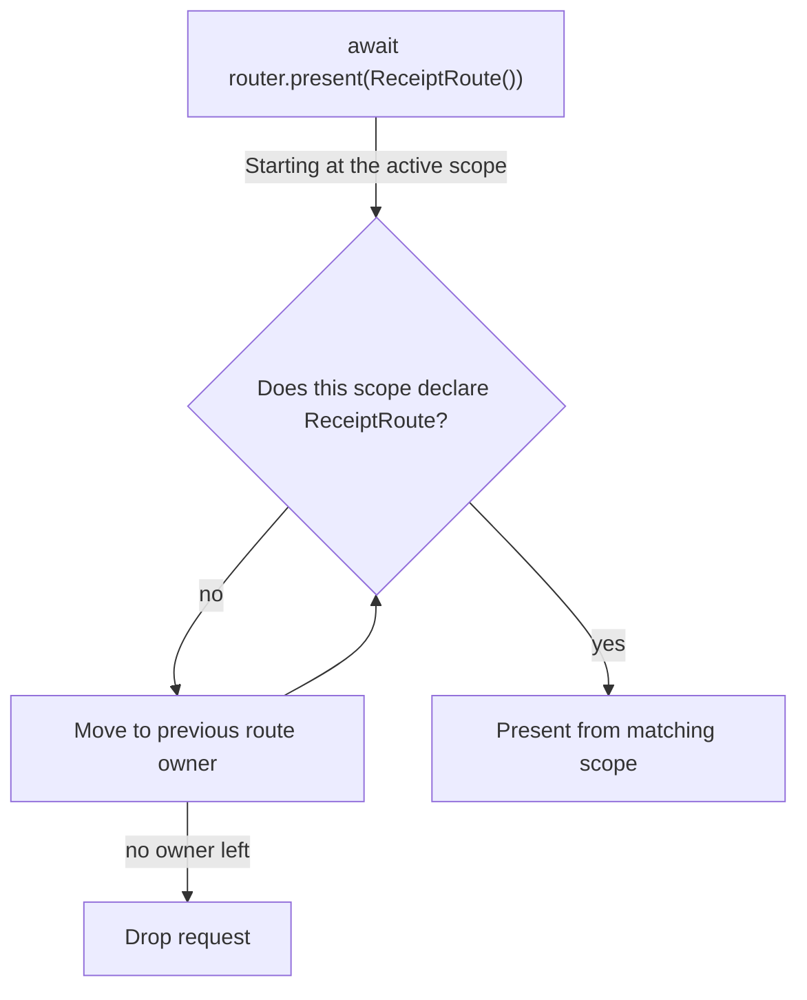
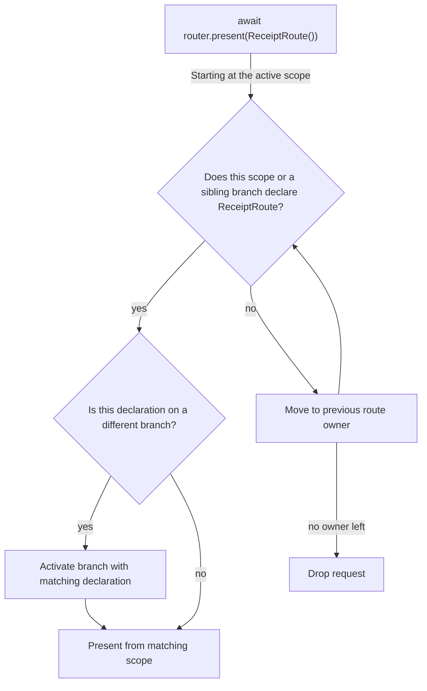
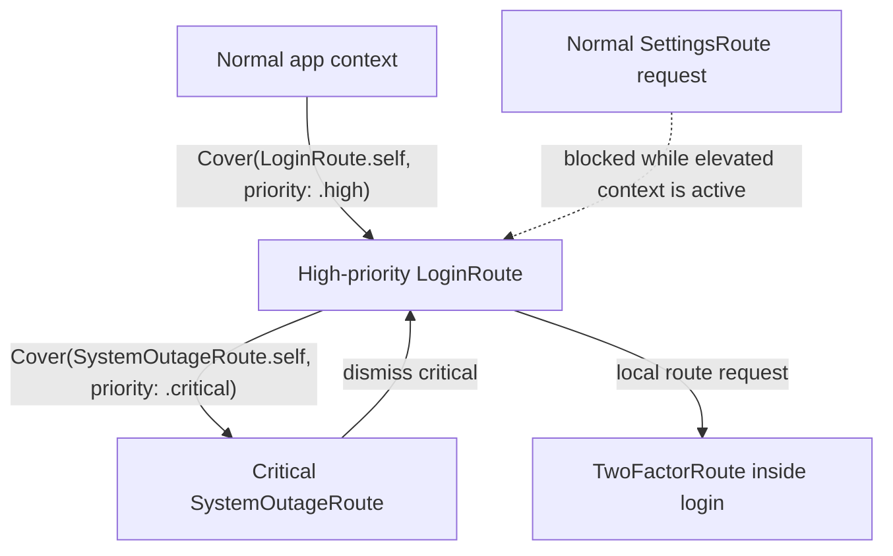

# 🛫 Departure

`Departure` is a lightweight, expressive routing framework for SwiftUI.

It lets views declare the routes they can handle and the presentation style for each route. The router then presents the closest matching route. Triggered actions run against the active route scope, can be intercepted by route-scoped hooks, and can request a reroute before execution is retried.

```swift
await router.present(SettingsRoute())
```

## Install

`Departure` is available via Swift Package Manager, and supports iOS 17.5 or later.

```swift
dependencies: [
  .package(url: "https://github.com/mtzaquia/departure.git", from: "1.2.0"),
],
```

## Quick start

This is the smallest end-to-end shape: install a router, define a route, declare where that route can be presented, then ask the router to present it.

```swift
@main
struct ExampleApp: App {
  var body: some Scene {
    WindowGroup {
      WithRouter {
        NavigationStack {
          HomeView()
        }
      }
    }
  }
}

struct SettingsRoute: Route {
  func destination() -> some View {
    SettingsView()
  }
}

struct SettingsView: View {
  var body: some View {
    Text("Settings")
  }
}

struct HomeView: View {
  @Environment(Router.self) private var router

  var body: some View {
    Button("Settings") {
      Task {
        await router.present(SettingsRoute())
      }
    }
    .routes {
      Sheet(SettingsRoute.self)
    }
  }
}
```

> [!NOTE]
> When using `Push(...)` inside `.routes { ... }`, ensure the route is declared within a `NavigationStack`.

## Routes and Actions

### Routes

A route is a value that builds its destination.

```swift
struct SettingsRoute: Route {
  func destination() -> some View {
    SettingsView()
  }
}
```

Routes can also allow, redirect, or drop themselves before ownership is resolved.

```swift
struct ProtectedSettingsRoute: Route {
  let isLoggedIn: Bool

  func resolveRoute() async -> RouteResolution {
    isLoggedIn ? .allow : .reroute(LoginRoute())
  }

  func destination() -> some View {
    SettingsView()
  }
}
```

> [!IMPORTANT]
> On `.reroute(route)`, `Departure` evaluates the new route before matching it to an owner. Keep resolution quick and avoid recursive reroutes.

### Actions

Actions are work values that run against the active route scope.

```swift
struct SaveDraftAction: Action {
  func attemptAction(in context: ActionContext) async throws(ActionInvocationError) {
    guard context.isRunning(in: EditorRoute.self) else {
      throw .reroute(EditorRoute())
    }

    // Save the draft.
  }
}
```

If an action throws `.reroute(route)`, `Departure` requests that route, then retries the action **once**.

## Declarations

### `.routes(...)`

Declare routes in the scope that can present them.

```swift
.routes {
  Push(ProfileRoute.self)
  Sheet(SettingsRoute.self)
  Cover(OnboardingRoute.self)
}
```

The nearest matching scope, including the current scope, presents the route with the declared style. You can declare the same route type in multiple places; the nearest matching owner wins.

| Style | Behavior |
| --- | --- |
| `Push` | Pushes onto the nearest `NavigationStack`. |
| `Sheet` | Presents a sheet. |
| `Cover` | Presents a full-screen cover. |

> [!NOTE]
> `Sheet` and `Cover` wrap their destinations in a `NavigationStack` by default. Opt out using
> `providesNavigation: false`.

### `.hooks(...)`

Hooks are route-scoped behavior declarations. Attach them with `.hooks { ... }` on the view that owns the behavior.

```swift
struct EditorView: View {
  var body: some View {
    EditorContent()
      .hooks {
        ActionInterceptor(SaveDraftAction.self) { invocation in
          do {
            try await invocation()
          } catch {
            // React to the failed save attempt.
          }
        }
      }
  }
}
```

Hooks attach to the current route scope and share its lifecycle.

| Hook | Behavior |
| --- | --- |
| `ActionInterceptor` | Wraps or replaces execution for a matching action type. |
| `UnwindHandler` | Reacts when a descendant route unwinds back to that scope. |

For actions, `Departure` checks only the active scope for a matching `ActionInterceptor`. If no interceptor matches, the action is attempted directly. If an interceptor matches, **that interceptor owns the action flow** and must call `invocation()` when the original action should run.

```swift
.hooks {
  ActionInterceptor(DeleteDraftAction.self) { _ in
    // Consume the action without running DeleteDraftAction.attemptAction(in:).
  }
}
```

If an intercepted action throws `.reroute(route)` from its original implementation, `invocation()` will perform the reroute, retry the action in the new scope, and throw a `CancellationError` in the current interceptor.

`UnwindHandler` can also expect a typed payload. **The handler only runs when the unwind payload matches the declared payload type.** A warning is emitted if the expected payload type doesn't match the one provided.

```swift
.hooks {
  UnwindHandler(EditorRoute.self, expecting: SaveResult.self) { result in
    showToast(for: result)
  }
}
```

> [!NOTE]
> If the route and target scope match, SwiftUI's `dismiss()` also triggers unwind handlers with no payloads.

### Duplicate declarations

If a scope declares multiple handlers for the same route, multiple action interceptors for the same action, or multiple unwind handlers for the same route, only the first declaration is used; all subsequent declarations are ignored. In these cases, `Departure` emits a runtime warning.

```swift
.routes {
  Sheet(MessageRoute.self) // Used for MessageRoute.
  Cover(MessageRoute.self) // Ignored; the first declaration wins.
}

.hooks {
  ActionInterceptor(SaveDraftAction.self) { invocation in
    try? await invocation()
  }

  ActionInterceptor(SaveDraftAction.self) { _ in
    // Ignored; the first interceptor wins.
  }
}
```

## Router calls

### `.present(...)`

Use `present` to request a route.

```swift
struct ToolbarView: View {
  @Environment(Router.self) private var router

  var body: some View {
    Button("Settings") {
      Task {
        await router.present(SettingsRoute())
      }
    }
  }
}
```

Route requests crawl backward to find an owner.



That gives feature views a simple rule:

_Declare the routes you can present. If a child scope asks for one of those routes and cannot handle it, the request comes back to you._

> [!NOTE]
> If no active scope can resolve the route type, the request is ignored.

### `.perform(...)`

Use `perform` to run an action from SwiftUI through the router.

```swift
struct ToolbarView: View {
  @Environment(Router.self) private var router

  var body: some View {
    Button("Save") {
      Task {
        await router.perform(SaveDraftAction())
      }
    }
  }
}
```

Actions do not crawl for work execution; they run in the active route scope, or unconditionally when there are no interceptors.

### `.unwind(...)`

Unwind is the counterpart to presentation: it allows scopes to dismiss themselves or return to a known route scope.

```swift
await router.unwind()
```

Use an explicit target when you want to dismiss more than one route:

```swift
await router.unwind(to: .root)
await router.unwind(to: .nearestBranch)
await router.unwind(to: .id("settings-flow"))
```

| API | Behavior |
| --- | --- |
| `await router.unwind()` | Dismisses the current route. |
| `await router.unwind(to: .root)` | Returns to the app root, clearing presented routes and any branch containers owned by those routes. |
| `await router.unwind(to: .nearestBranch)` | Clears the nearest enclosing branch path back to that branch's root without unwinding to the app root. |
| `await router.unwind(to: .id(id))` | Keeps the matching route scope and dismisses everything after it. |

> [!NOTE]
> Branch paths live under the scope that declares their `.routes(branch:)` container. If an unwind goes past that container scope, all of its branches are destroyed. If the container scope remains installed after an unwind, inactive branch push stacks aren't impacted.

To unwind to a specific scope, tag it with an explicit ID:

```swift
SettingsFlowView()
  .routes(id: "settings-flow") {
    Push(AdvancedSettingsRoute.self)
    Sheet(AccountRoute.self)
  }
```

Unwinding is a suspending operation. Once it finishes, it is safe to present a new route.

```swift
await router.unwind()
await router.present(ProfileRoute())

if await router.unwind(to: .id("settings-flow")) {
  await router.present(LoginRoute(nextRoute: ProfileRoute()))
}

await router.unwind(to: .id("documents"), payload: SaveResult.saved)
```

> [!NOTE]
> `unwind(to:)` returns `false` when an explicit target is not found. Check the return value before presenting a continuation route if your flow requires it.

## Branches

Use branched scopes for selection-based containers with lazy content, such as `TabView`.

```swift
enum AppTab: Hashable, Sendable {
  case home
  case wallet
}

struct RootView: View {
  @State private var tab: AppTab = .home

  var body: some View {
    TabView(selection: $tab) {
      NavigationStack {
        HomeView()
          .routeBranch(AppTab.home)
      }
      .tag(AppTab.home)

      NavigationStack {
        WalletView()
          .routeBranch(AppTab.wallet)
      }
      .tag(AppTab.wallet)
    }
    .routes(branch: $tab) {
      Cover(LoginRoute.self)

      Branch(.home) {
        Push(HomeDetailRoute.self)
      }

      Branch(.wallet) {
        Sheet(TransactionRoute.self)
      }
    }
  }
}
```

`.routes(branch:)` declares the full route map for a selection container. This lets `Departure` find routes in lazy branches that have not been built yet.

Declarations inside `Branch(...)` are used for crawling and branch selection at the container. They are also adopted by the matching `.routeBranch(...)` view as local presentation declarations. Adopted declarations have lower priority than explicit declarations on the scope. If a request matches a route declared in an inactive branch, `Departure` selects that branch before presenting the route from the installed `.routeBranch(...)` host.

Top-level declarations in the same `.routes(branch:)` builder, such as `Cover(LoginRoute.self)`, belong to the container itself. 

To unwind within the current branch without escaping to the app root, target `.nearestBranch`.

```swift
await router.unwind(to: .nearestBranch)
```

This clears the nearest enclosing branch path back to that branch's root. The accepted target scope is the branch container that declared the branch. To target the installed branch root itself, unwind to that branch root's explicit ID.



> [!NOTE]
> Each branch on a branched scope has its own path for pushed presentations. Modal presentations are
> mutually exclusive within the branched scope.

## Elevated-priority presentations

Sheets and covers can have normal, high, or critical priority.

```swift
.routes {
  Sheet(ProfileRoute.self)
  Cover(LoginRoute.self, priority: .high)
  Cover(SystemOutageRoute.self, priority: .critical)
}
```

| Priority | Behavior |
| --- | --- |
| `.normal` | Presents from the nearest eligible scope, **unless an active elevated-priority context is blocking declarations outside it.** |
| `.high` | Presents above normal-priority routes in a separate `UIWindow`. |
| `.critical` | Presents above high-priority routes in a separate `UIWindow` with `windowLevel == .alert`. |

- Requests matched inside an active context with priority **greater than or equal to** the declaration's priority act locally.
- Higher-priority requests start or replace their own context above lower-priority contexts; dismissing them reveals the lower context underneath.
- Lower-priority requests matched outside the active elevated context are blocked.

> [!IMPORTANT]
> Elevated priority changes presentation context, not route lookup. Branch routes are still resolved with the same crawling rules; when an elevated-priority branch route is selected, the elevated window uses the active branch presentation scope.

Because elevated-priority presentations use separate `UIWindow`s, SwiftUI cannot automatically propagate custom environment values. Use the `windowDestination` parameter from `WithRouter` to customize these destinations.

```swift
WithRouter {
  AppRoot()
} windowDestination: { destination, environment in
  destination
    .environment(\.myCustomKey, environment.myCustomKey)
}
```

> [!IMPORTANT]
> Normal-priority routes **do not** allow customization through the `windowDestination` builder.



## License

Copyright (c) 2026 @mtzaquia

Permission is hereby granted, free of charge, to any person obtaining a copy
of this software and associated documentation files (the "Software"), to deal
in the Software without restriction, including without limitation the rights
to use, copy, modify, merge, publish, distribute, sublicense, and/or sell
copies of the Software, and to permit persons to whom the Software is
furnished to do so, subject to the following conditions:

The above copyright notice and this permission notice shall be included in all
copies or substantial portions of the Software.

THE SOFTWARE IS PROVIDED "AS IS", WITHOUT WARRANTY OF ANY KIND, EXPRESS OR
IMPLIED, INCLUDING BUT NOT LIMITED TO THE WARRANTIES OF MERCHANTABILITY,
FITNESS FOR A PARTICULAR PURPOSE AND NONINFRINGEMENT. IN NO EVENT SHALL THE
AUTHORS OR COPYRIGHT HOLDERS BE LIABLE FOR ANY CLAIM, DAMAGES OR OTHER
LIABILITY, WHETHER IN AN ACTION OF CONTRACT, TORT OR OTHERWISE, ARISING FROM,
OUT OF OR IN CONNECTION WITH THE SOFTWARE OR THE USE OR OTHER DEALINGS IN THE
SOFTWARE.
