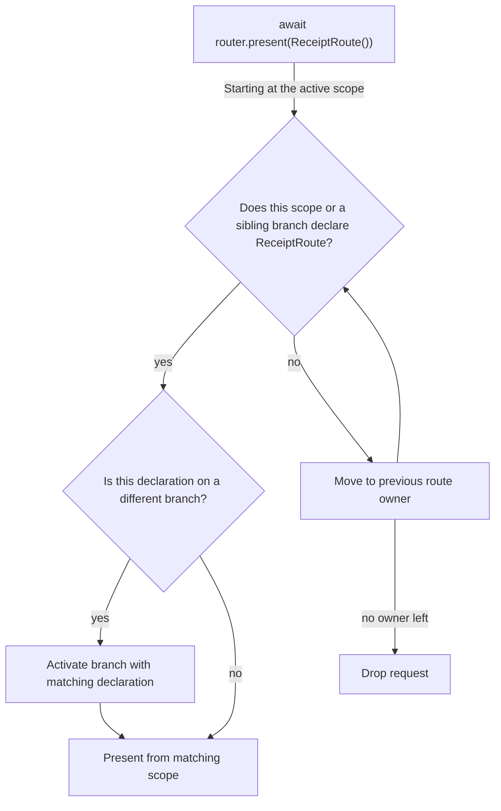
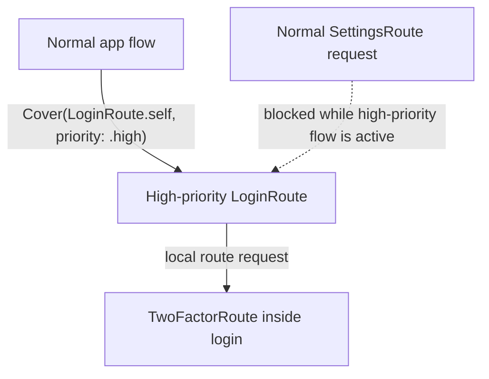

# 🛫 Departure

`Departure` is a lightweight, expressive routing framework for SwiftUI.

It lets views declare the routes they can handle and the presentation style for each route. The router then presents the closest matching route. In branched scopes, such as parallel tabs, it switches to the branch with a matching route when none is found in the active branch. Triggered actions can be intercepted by the topmost scope, and they can request a reroute before execution is retried.

```swift
await router.present(SettingsRoute())
```

## Install

`Departure` is available via Swift Package Manager.

```swift
dependencies: [
  .package(url: "https://github.com/mtzaquia/departure.git", from: "1.1.0"),
],
```

## Quick start

### Wrap your app

Use `WithRouter` near the root of your SwiftUI tree:

```swift
@main
struct ExampleApp: App {
  var body: some Scene {
    WindowGroup {
      WithRouter {
        NavigationStack {
          HomeView()
        }
      }
    }
  }
}
```

### Define a route

A route is a value that builds its destination.

```swift
struct SettingsRoute: Route {
  func destination() -> some View {
    SettingsView()
  }
}
```

Routes are matched by type. Two `SettingsRoute()` values target the same declaration.

### Declare it in the scope that can handle it

You can declare the same route type in multiple places. The nearest matching scope, including the current scope, presents it with the declared style.

```swift
struct HomeView: View {
  @Environment(Router.self) private var router

  var body: some View {
    Button("Settings") {
      Task {
        await router.present(SettingsRoute())
      }
    }
    .routes {
      Sheet(SettingsRoute.self)
    }
  }
}
```

> [!NOTE]
> When using `Push(...)` inside `.routes { ... }`, ensure the route is declared within a `NavigationStack`.

## Presentation styles

Use `Push`, `Sheet`, or `Cover` inside `.routes { ... }`.

```swift
.routes {
  Push(ProfileRoute.self)
  Sheet(SettingsRoute.self)
  Cover(OnboardingRoute.self)
}
```

Each style has different configuration options.

> [!NOTE]
> `Sheet` and `Cover` wrap their destinations in a `NavigationStack` by default. Opt out using
> `providesNavigation: false`.

## Route ownership

Route requests are resolved by route ownership.



That gives feature views a simple rule:

_Declare the routes you can present. If a child scope asks for one of those routes and cannot handle it, the request comes back to you._

> [!IMPORTANT]
> If no active scope or declared branch map can resolve the route type, the request is ignored.

## Branches

Use branches for selection-based containers such as tabs.

```swift
enum AppTab: Hashable, Sendable {
  case home
  case wallet
}

struct RootView: View {
  @State private var tab: AppTab = .home

  var body: some View {
    TabView(selection: $tab) {
      NavigationStack {
        HomeView()
          .routeBranch(AppTab.home)
      }
      .tag(AppTab.home)

      NavigationStack {
        WalletView()
          .routeBranch(AppTab.wallet)
      }
      .tag(AppTab.wallet)
    }
    .routes(branch: $tab) {
      Cover(LoginRoute.self, priority: .high)

      Branch(.home) {
        Push(HomeDetailRoute.self)
      }

      Branch(.wallet) {
        Sheet(TransactionRoute.self)
      }
    }
  }
}
```

`.routes(branch:)` declares the full route map for a selection container. This lets `Departure` find routes in lazy branches that have not been built yet. Declarations inside `Branch(...)` are used for crawling and branch selection at the container, then adopted by the matching `.routeBranch(...)` view as local presentation declarations. Adopted declarations have lower priority than explicit declarations on the scope.

Top-level declarations in the same `.routes(branch:)` builder, such as `Cover(LoginRoute.self, priority: .high)`, belong to the container itself. If a request matches a route declared in an inactive branch, `Departure` selects that branch before presenting the route from the mounted `.routeBranch(...)` host.

> [!NOTE]
> Each branch on a branched scope has its own path for pushed presentations. Modal presentations are
> mutually exclusive in the normal flow; the high-priority flow can still present modally over
> the current flow.

## Priority

Sheets and covers can have normal or high priority.

```swift
.routes {
  Sheet(ProfileRoute.self)
  Cover(LoginRoute.self, priority: .high)
}
```

| Priority | Behavior |
| --- | --- |
| `.normal` | Presents from the nearest eligible scope, **unless a high-priority presentation is already covering the normal flow.** |
| `.high` | Presents above the normal flow in a separate high-priority `UIWindow`. |

- A new high-priority request **matched in the normal flow** replaces the active high-priority presentation entirely.
- Routing requests **matched within the high-priority flow** always act like normal-priority requests.

> [!IMPORTANT]
> High priority changes presentation context, not route lookup. Branch routes are still resolved with the same crawling rules; when a high-priority branch route is selected, the high-priority window uses the active branch presentation scope.

### High-priority environment

Because high-priority presentations use a separate `UIWindow`, SwiftUI cannot automatically propagate custom environment values. Use the `windowDestination` parameter from `WithRouter` to customize these destinations.

```swift
WithRouter {
  AppRoot()
} windowDestination: { destination, environment in
  destination
    .environment(\.myCustomKey, environment.myCustomKey)
}
```

> [!IMPORTANT]
> Normal-priority routes **do not** allow customization through the `windowDestination` builder.



## Route resolution

Routes can allow, redirect, or drop themselves before ownership is resolved.

```swift
struct ProtectedSettingsRoute: Route {
  let isLoggedIn: Bool

  func resolveRoute() async -> RouteResolution {
    isLoggedIn ? .allow : .reroute(LoginRoute())
  }

  func destination() -> some View {
    SettingsView()
  }
}
```

> [!IMPORTANT]
> On `.reroute(route)`, `Departure` evaluates the new route before matching it to an owner. Keep resolution quick and avoid recursive reroutes.

## Actions

Actions are work values that run against the active route context.

```swift
struct SaveDraftAction: Action {
  func attemptAction(in context: ActionContext) async throws(ActionInvocationError) {
    guard context.isRunning(in: EditorRoute.self) else {
      throw .reroute(EditorRoute())
    }

    // Save the draft.
  }
}
```

Run an action from SwiftUI through the router:

```swift
struct ToolbarView: View {
  @Environment(Router.self) private var router

  var body: some View {
    Button("Save") {
      Task {
        await router.perform(SaveDraftAction())
      }
    }
  }
}
```

If an action throws `.reroute(route)`, `Departure` requests that route using the same ownership rules, then retries the action once.

> [!NOTE]
> Route requests crawl backward to find an owner. Actions do not crawl for work execution; they run in the active route context, or unconditionally when there are no interceptors.

## Hooks

Hooks are route-scoped behavior declarations. Attach them with `.hooks { ... }` on the view that owns the behavior.

```swift
struct EditorView: View {
  var body: some View {
    EditorContent()
        .hooks {
          ActionInterceptor(SaveDraftAction.self) { invocation in
            do {
              try await invocation()
            } catch {
              // React to the failed save attempt.
            }
          }
        }
  }
}
```

Hooks attach to the current route scope and share its lifecycle. Inside a selected `.routeBranch(...)`, hooks attach to that branch-local scope, so selected tab content can intercept actions without changing route ownership. For actions, `Departure` checks only the active scope for a matching `ActionInterceptor`. If no interceptor matches, the action runs normally. If an interceptor matches, **that interceptor owns the action flow** and must call `invocation()` when the original action should run.

### Action interceptors

`ActionInterceptor` lets a scope wrap or replace execution for a matching action type.

```swift
.hooks {
  ActionInterceptor(SaveDraftAction.self) { invocation in
    try? await invocation()
  }
}
```

The interceptor receives an `invocation` closure for the original action. Call it to continue action execution, or do not call it to consume the action.

```swift
.hooks {
  ActionInterceptor(DeleteDraftAction.self) { _ in
    // Consume the action without running DeleteDraftAction.attemptAction(in:).
  }
}
```

If an intercepted action throws `.reroute(route)` from its original implementation, `invocation()` will perform the reroute, retry the action in the new scope, and throw a `CancellationError` in the current interceptor.

## Unwind

Unwind is the counterpart to presentation: it allows scopes to dismiss themselves or return to a known route scope.

```swift
await router.unwind()
```

Use an explicit target when you want to dismiss more than one route:

```swift
await router.unwind(to: .root)
await router.unwind(to: .nearestBranch)
await router.unwind(to: .id("settings-flow"))
```

| API | Behavior |
| --- | --- |
| `await router.unwind()` | Dismisses the current route. |
| `await router.unwind(to: .root)` | Clears all presented routes and returns to the root scope. |
| `await router.unwind(to: .nearestBranch)` | Clears the nearest enclosing branch path back to that branch's root without escaping to the app root. |
| `await router.unwind(to: .id(id))` | Keeps the matching route scope and dismisses everything after it. |

To unwind to a specific scope, tag it with an explicit ID:

```swift
SettingsFlowView()
  .routes(id: "settings-flow") {
    Push(AdvancedSettingsRoute.self)
    Sheet(AccountRoute.self)
  }
```

Unwinding is a suspending operation. Once it finishes, it is safe to present a new route.

```swift
await router.unwind()
await router.present(ProfileRoute())

if await router.unwind(to: .id("settings-flow")) {
  await router.present(LoginRoute(nextRoute: ProfileRoute()))
}
```

> [!NOTE]
> `unwind(to:)` returns `false` when an explicit target is not found. Check the return value before presenting a continuation route if your flow requires it.

## License

Copyright (c) 2026 @mtzaquia

Permission is hereby granted, free of charge, to any person obtaining a copy
of this software and associated documentation files (the "Software"), to deal
in the Software without restriction, including without limitation the rights
to use, copy, modify, merge, publish, distribute, sublicense, and/or sell
copies of the Software, and to permit persons to whom the Software is
furnished to do so, subject to the following conditions:

The above copyright notice and this permission notice shall be included in all
copies or substantial portions of the Software.

THE SOFTWARE IS PROVIDED "AS IS", WITHOUT WARRANTY OF ANY KIND, EXPRESS OR
IMPLIED, INCLUDING BUT NOT LIMITED TO THE WARRANTIES OF MERCHANTABILITY,
FITNESS FOR A PARTICULAR PURPOSE AND NONINFRINGEMENT. IN NO EVENT SHALL THE
AUTHORS OR COPYRIGHT HOLDERS BE LIABLE FOR ANY CLAIM, DAMAGES OR OTHER
LIABILITY, WHETHER IN AN ACTION OF CONTRACT, TORT OR OTHERWISE, ARISING FROM,
OUT OF OR IN CONNECTION WITH THE SOFTWARE OR THE USE OR OTHER DEALINGS IN THE
SOFTWARE.
